# LeaveFlow

**Autor:** Cringasu Elisa-Maria  
**Grupa:** SIMPRE, grupa 1145  
**Disciplina:** Cloud Computing  

Aplicatie web pentru gestionarea cererilor de concediu intr-o organizatie.

**Repository GitHub:** <https://github.com/cringasuelisa/LeaveFlow>  
**Link publicare:** <https://leaveflow-yx0s.onrender.com/leaves/>  
**Link video prezentare:** <https://youtu.be/iHOIM-MOQp8>  

## 1. Introducere

LeaveFlow este o aplicatie web dezvoltata in Django pentru digitalizarea fluxului de cereri de concediu. Angajatii isi pot crea cont, pot trimite cereri de concediu cu perioada, motiv si atasament optional, iar managerii pot aproba sau respinge cererile. La aprobare se salveaza si o semnatura electronica, apoi se poate genera documentul final si PDF-ul cererii aprobate.

Aplicatia foloseste servicii cloud prin API-uri REST:

- **Cloudinary** pentru stocarea atasamentelor si semnaturilor.
- **Resend** pentru trimiterea notificarilor email prin API HTTP.
- **Render** pentru publicarea aplicatiei si baza de date PostgreSQL administrata.

## 2. Descriere problema

In multe organizatii, cererile de concediu sunt gestionate prin emailuri, fisiere trimise manual sau documente tiparite. Acest proces este greu de urmarit, poate duce la pierderea istoricului si necesita timp suplimentar pentru aprobari, notificari si arhivare.

LeaveFlow rezolva aceasta problema printr-un flux centralizat:

- angajatul completeaza o cerere online;
- sistemul calculeaza automat numarul de zile;
- managerii primesc notificare pe email;
- managerul aproba sau respinge cererea;
- angajatul primeste automat decizia;
- documentele si semnaturile sunt pastrate in cloud;
- cererile aprobate apar intr-un calendar interactiv.

## 3. Descriere API

Aplicatia expune rute HTTP proprii prin Django si consuma doua servicii cloud externe prin API REST.

### Servicii cloud utilizate

| Serviciu | Rol in aplicatie | Integrare |
|----------|------------------|-----------|
| Cloudinary | Stocare fisiere: atasamente PDF/DOCX si imagini cu semnatura | `django-cloudinary-storage`, peste API-ul Cloudinary |
| Resend | Email tranzactional pentru cereri noi si decizii | backend custom in `leaves/email_backend.py`, request HTTP `POST` catre `https://api.resend.com/emails` |
| Render | Hosting web si PostgreSQL administrat | deploy din GitHub prin `render.yaml` |

### Endpoint-uri interne principale

| Metoda | Ruta | Rol | Acces |
|--------|------|-----|-------|
| `GET` | `/leaves/` | Dashboard angajat sau manager | utilizator autentificat |
| `GET`, `POST` | `/leaves/register/` | Creare cont | public |
| `GET` | `/leaves/requests/` | Lista cereri | angajat: doar cererile proprii; manager/admin: toate |
| `GET`, `POST` | `/leaves/requests/new/` | Formular cerere noua | utilizator autentificat |
| `GET` | `/leaves/requests/<id>/` | Detalii cerere | proprietar sau manager/admin |
| `GET`, `POST` | `/leaves/requests/<id>/approve/` | Aprobare cu semnatura | manager/admin |
| `GET`, `POST` | `/leaves/requests/<id>/reject/` | Respingere cu motiv | manager/admin |
| `GET` | `/leaves/requests/<id>/document/` | Document HTML pentru cerere aprobata | proprietar sau manager/admin |
| `GET` | `/leaves/requests/<id>/pdf/` | Export PDF pentru cerere aprobata | proprietar sau manager/admin |
| `GET` | `/leaves/calendar/` | Calendar concedii aprobate | manager/admin |
| `GET` | `/leaves/calendar/events/` | Evenimente JSON pentru calendar | manager/admin |

### Autentificare si autorizare

Autentificarea se face prin sistemul Django Auth, cu sesiuni si cookie-uri securizate in productie. Formularele `POST` sunt protejate cu CSRF.

Aplicatia foloseste trei roluri:

- `employee` - poate crea si vedea propriile cereri;
- `manager` - poate vedea toate cererile, aproba, respinge si consulta calendarul;
- `admin` - are drepturi de manager si acces la administrarea Django.

Controlul de acces este implementat prin `LoginRequiredMixin`, `ManagerRequiredMixin` si verificari suplimentare in view-urile de detaliu/document/PDF.

### Exemplu request/response intern

Request catre endpoint-ul JSON al calendarului:

```http
GET /leaves/calendar/events/?start=2026-05-01&end=2026-06-01 HTTP/1.1
Host: leaveflow-yx0s.onrender.com
Cookie: sessionid=...
Accept: application/json
```

Response:

```json
[
  {
    "id": 12,
    "title": "Elisa Cringasu - Concediu de odihna",
    "start": "2026-05-20",
    "end": "2026-05-25",
    "allDay": true,
    "backgroundColor": "#4f46e5",
    "borderColor": "#4f46e5",
    "url": "/leaves/requests/12/",
    "extendedProps": {
      "employee": "Elisa Cringasu",
      "department": "IT",
      "type": "Concediu de odihna",
      "days": 5
    }
  }
]
```

### Exemplu request/response Resend

Backend-ul custom trimite emailuri prin HTTP:

```http
POST https://api.resend.com/emails HTTP/1.1
Authorization: Bearer RESEND_API_KEY
Content-Type: application/json
```

Payload:

```json
{
  "from": "LeaveFlow <onboarding@resend.dev>",
  "to": ["manager@example.com"],
  "subject": "[LeaveFlow] Cerere noua de la Elisa Cringasu",
  "text": "A fost trimisa o cerere noua de concediu.",
  "html": "<p>A fost trimisa o cerere noua de concediu.</p>"
}
```

Response tipic:

```json
{
  "id": "email_id_generat_de_resend"
}
```

### Exemplu upload Cloudinary

Cand angajatul adauga un atasament sau managerul salveaza semnatura, fisierul este transmis catre Cloudinary prin storage backend:

```http
POST https://api.cloudinary.com/v1_1/<cloud_name>/auto/upload HTTP/1.1
Content-Type: multipart/form-data
```

Campuri relevante:

```text
file=<fisier PDF/DOCX sau imagine semnatura>
api_key=<CLOUDINARY_API_KEY>
signature=<semnatura generata cu API secret>
timestamp=<unix timestamp>
```

Rezultat relevant pentru aplicatie:

```json
{
  "secure_url": "https://res.cloudinary.com/<cloud_name>/...",
  "public_id": "leaves/signatures/signature_abc123",
  "resource_type": "image"
}
```

## 4. Flux de date

1. Utilizatorul isi creeaza cont sau se autentifica.
2. Angajatul completeaza formularul de cerere: tip concediu, data inceput, data sfarsit, motiv si atasament optional.
3. Django valideaza datele:
   - data de sfarsit nu poate fi inaintea datei de inceput;
   - atasamentele pot fi doar PDF/DOCX;
   - dimensiunea maxima a atasamentului este 5 MB.
4. Cererea este salvata in baza de date, iar numarul de zile este calculat automat.
5. Daca exista atasament, fisierul este incarcat in Cloudinary.
6. Aplicatia trimite notificare catre manageri prin Resend.
7. Managerul deschide cererea si o aproba sau respinge.
8. La aprobare, semnatura este salvata in Cloudinary si cererea primeste status `approved`.
9. La respingere, se salveaza motivul respingerii si cererea primeste status `rejected`.
10. Angajatul este notificat prin Resend.
11. Pentru cererile aprobate se poate consulta documentul oficial, exporta PDF-ul si vedea perioada in calendar.

## 5. Capturi ecran aplicatie

Capturile sunt incluse in repository in directorul [`docs/screenshots`](docs/screenshots).

| Ecran | Captura |
|-------|---------|
| Dashboard manager | 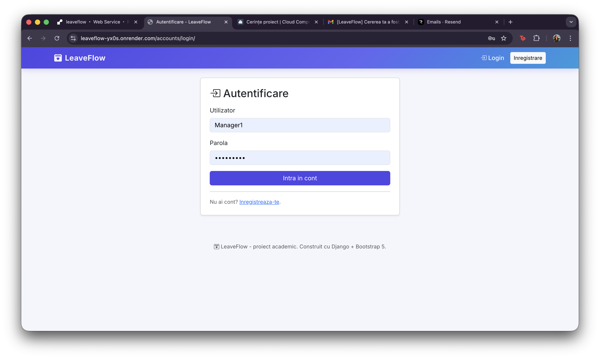 |
| Dashboard angajat | 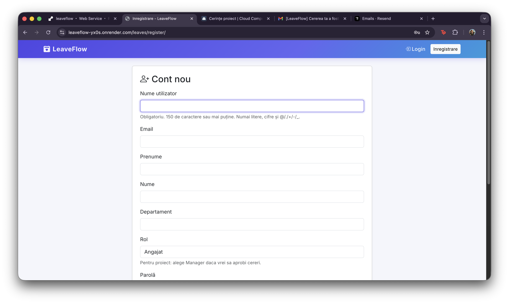 |
| Cerere noua | 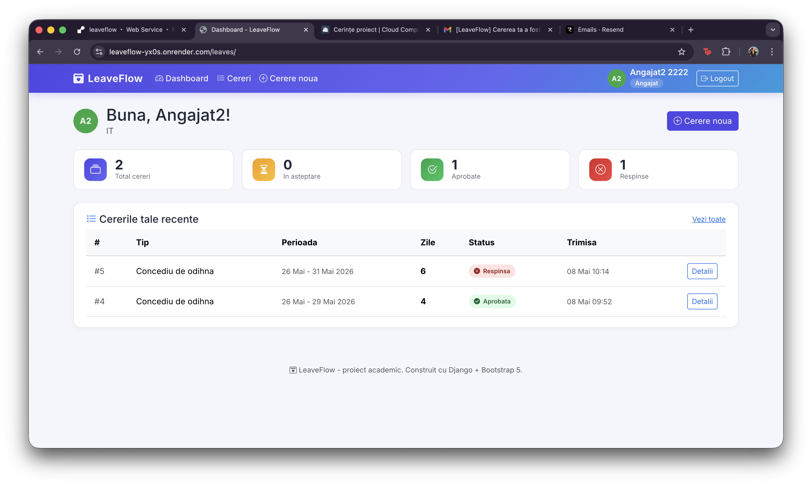 |
| Detalii cerere | 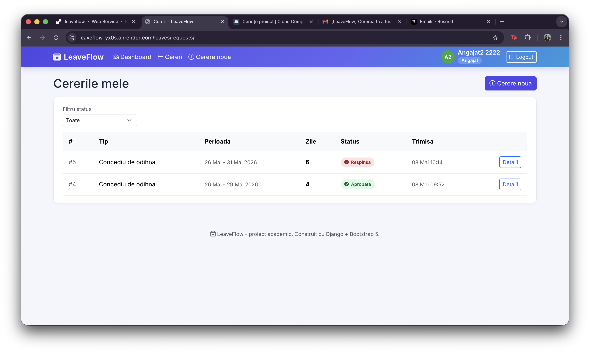 |
| Aprobare cu semnatura | 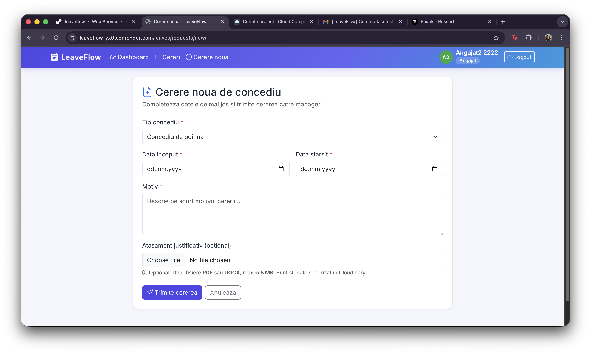 |
| Cerere aprobata | 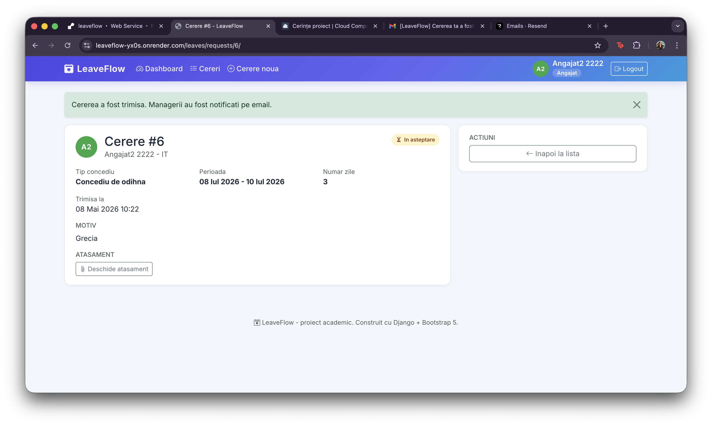 |
| Notificare email cerere noua | 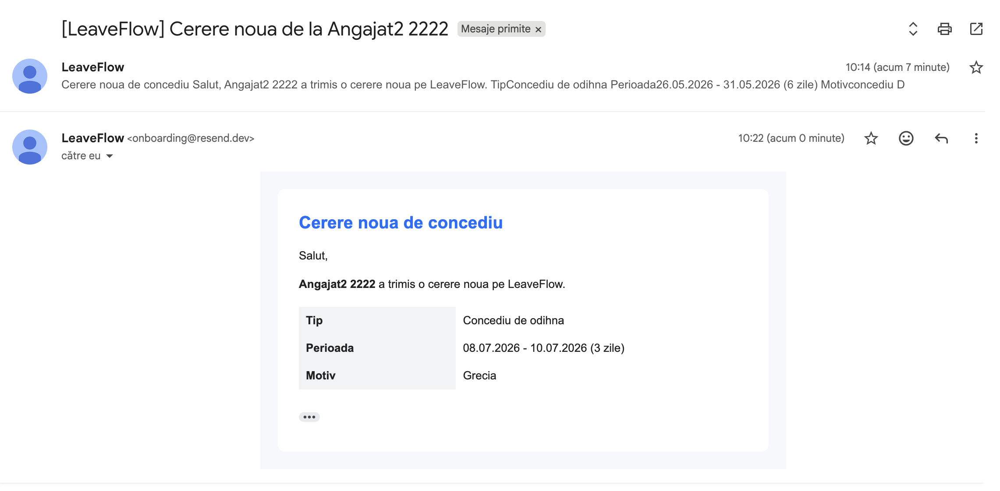 |
| Calendar concedii | 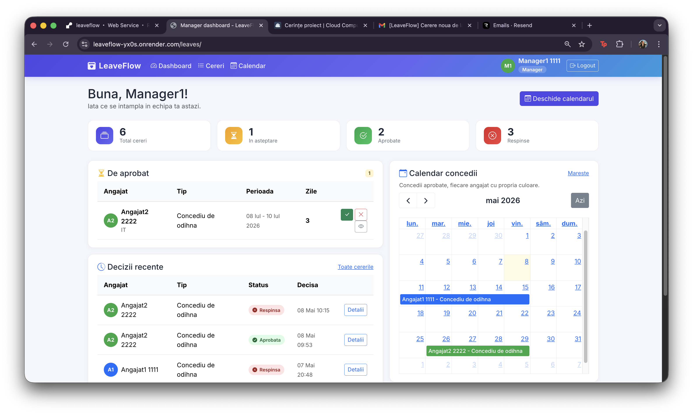 |
| Lista cereri | 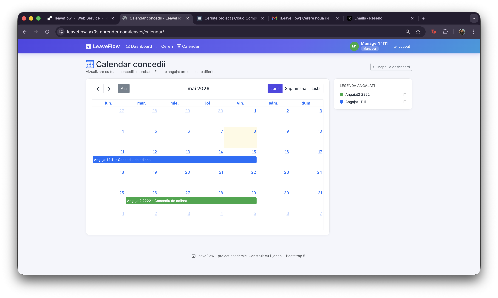 |
| Document cerere aprobata | 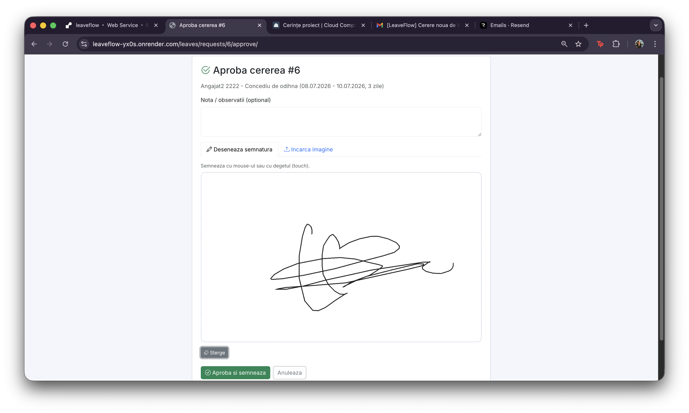 |
| Export PDF | 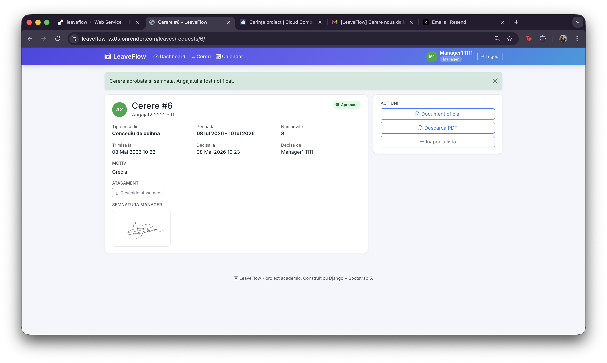 |
| Notificare email decizie | 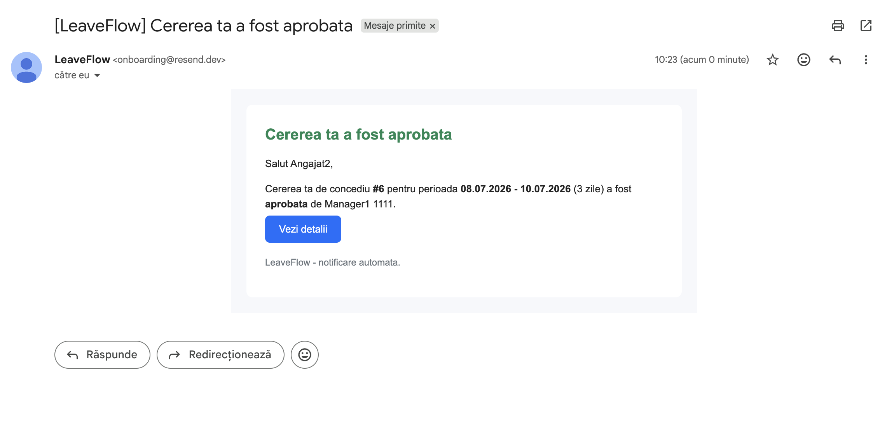 |
| Respingere cerere | 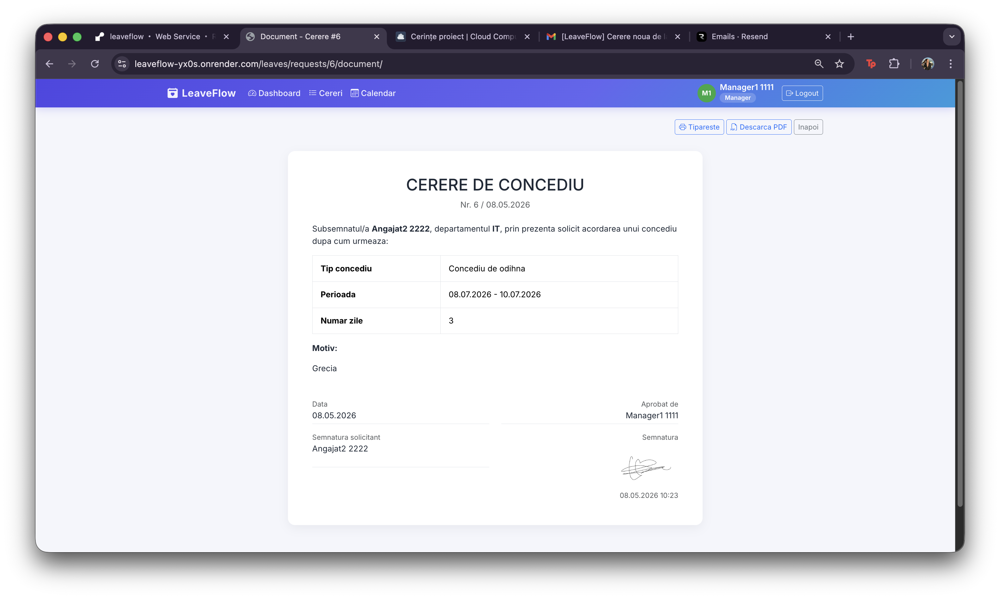 |
| Login / register | 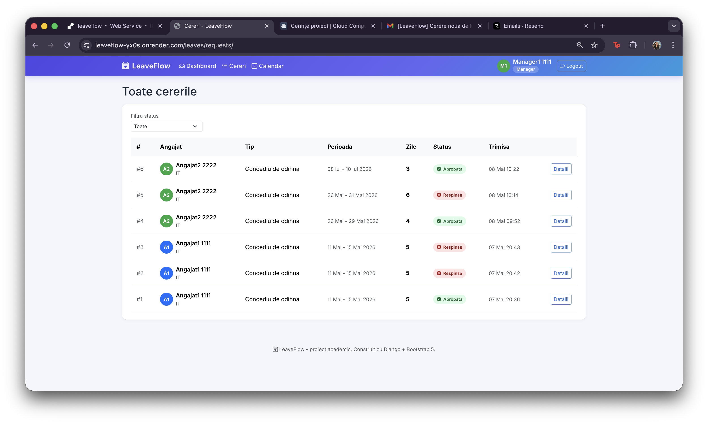 |

## Stack tehnologic

- Python 3.11 / Django 4.2
- Django Templates + Bootstrap 5
- PostgreSQL in productie / SQLite local
- Cloudinary pentru storage fisiere
- Resend pentru email tranzactional
- ReportLab pentru generare PDF
- Gunicorn + WhiteNoise pentru productie
- Render.com pentru hosting

## Rulare locala

```bash
git clone https://github.com/cringasuelisa/LeaveFlow.git
cd LeaveFlow

python3 -m venv .venv
source .venv/bin/activate
pip install -r requirements.txt

cp .env.example .env
# editeaza .env si completeaza DJANGO_SECRET_KEY si, optional, cheile Cloudinary/Resend

python manage.py migrate
python manage.py createsuperuser
python manage.py runserver
```

Aplicatia ruleaza local la <http://127.0.0.1:8000/>.

## Variabile de mediu

Toate variabilele sunt documentate in `.env.example`.

| Variabila | Rol |
|-----------|-----|
| `DJANGO_SECRET_KEY` | Cheia secreta Django |
| `DJANGO_DEBUG` | Activeaza/dezactiveaza modul debug |
| `DJANGO_ALLOWED_HOSTS` | Hostnames permise |
| `DJANGO_CSRF_TRUSTED_ORIGINS` | Origini permise pentru CSRF in productie |
| `DATABASE_URL` | URL PostgreSQL; daca lipseste, se foloseste SQLite local |
| `DATABASE_SSL` | Activeaza SSL pentru PostgreSQL |
| `CLOUDINARY_CLOUD_NAME` | Numele contului Cloudinary |
| `CLOUDINARY_API_KEY` | Cheie API Cloudinary |
| `CLOUDINARY_API_SECRET` | Secret API Cloudinary |
| `RESEND_API_KEY` | Cheie API Resend |
| `DEFAULT_FROM_EMAIL` | Adresa expeditor pentru emailuri |

## Deploy pe Render

Proiectul include `render.yaml`, folosit ca Blueprint Render.

Pasi de publicare:

1. Se creeaza un cont pe <https://render.com> si se conecteaza GitHub.
2. In Render se alege `New +` -> `Blueprint`.
3. Se selecteaza repository-ul `LeaveFlow`.
4. Se completeaza manual variabilele Cloudinary si Resend marcate cu `sync: false`.
5. Render creeaza web service-ul Python si baza de date PostgreSQL.
6. La fiecare `git push`, Render ruleaza `build.sh`, executa migrarile si reporneste aplicatia.

## 6. Referinte

- Django Documentation: <https://docs.djangoproject.com/>
- Django Authentication: <https://docs.djangoproject.com/en/4.2/topics/auth/>
- Cloudinary Upload API: <https://cloudinary.com/documentation/image_upload_api_reference>
- django-cloudinary-storage: <https://github.com/klis87/django-cloudinary-storage>
- Resend Email API: <https://resend.com/docs/api-reference/emails/send-email>
- Render Blueprint Spec: <https://render.com/docs/blueprint-spec>
- ReportLab User Guide: <https://docs.reportlab.com/>
- Bootstrap Documentation: <https://getbootstrap.com/docs/>
